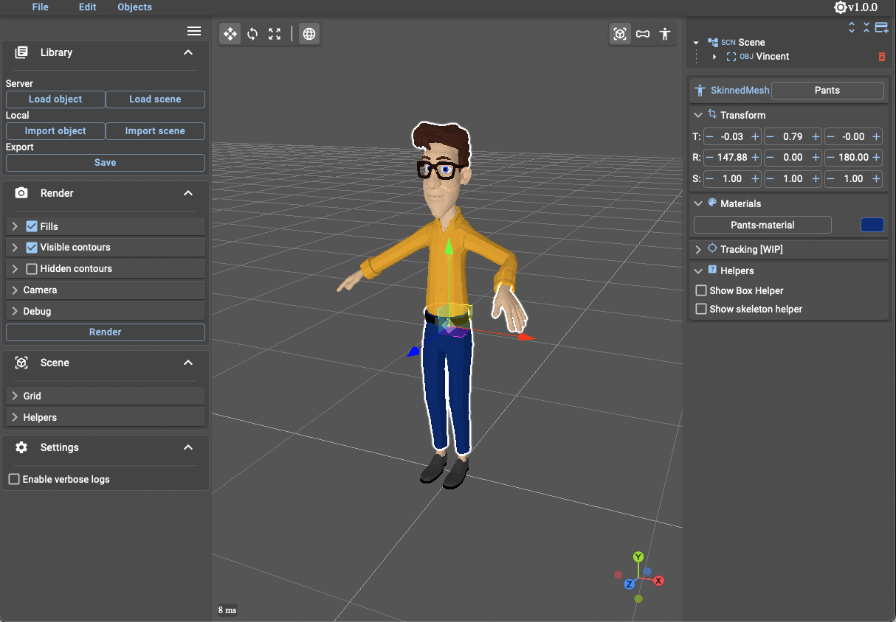
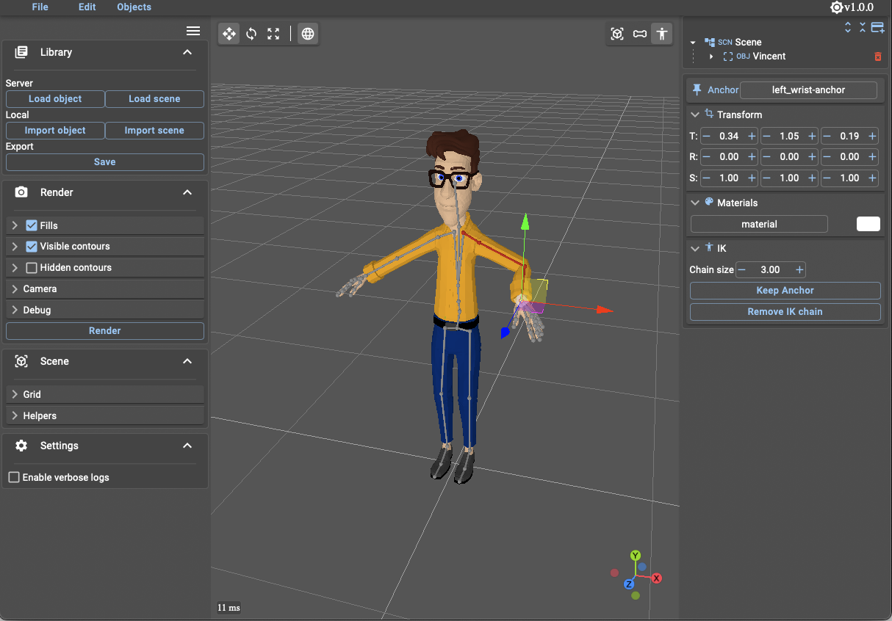

# Esquisse

Esquisse is a web application built with React and Typescript to facilitate the production of Vector Graphics illustrations.
Esquisse proposes interaction techniques to ease the manipulation of 3D objects and a custom vector graphics render engine.

## Web App 

[Open Esquisse Web App](https://lokiresearch.github.io/esquisse/build)

## Features

- Supported formats: gltf, glb, obj
- Load/Save scenes
- Multiple selection support
- Undo/Redo
- Customize svg rendering
- Embed png/jpg/svg textures on objects
- Control skeletons via Inverse Kinematics
- Control skeletons via Camera with tensor flow (in progress)

## References and links

- Esquisse as a Blender Add-on [Github repo](https://github.com/LokiResearch/EsquisseBlender)

#### Papers

- Antoine Axel, Malacria Sylvain, Marquardt Nicolai and Casiez Géry. Esquisse: Using 3D Models Staging to Facilitate the Creation of Vector-Based Trace Figures, Human-Computer Interaction, INTERACT 2019. [https://hal.inria.fr/hal-02293837/document](https://hal.inria.fr/hal-02293837/document)

#### Objects

- Thanks to Blender for the character models [Vincent](https://studio.blender.org/characters/5718a967c379cf04929a4247/v1/) and [Rain](https://studio.blender.org/characters/5f1ed640e9115ed35ea4b3fb/v2/) 

